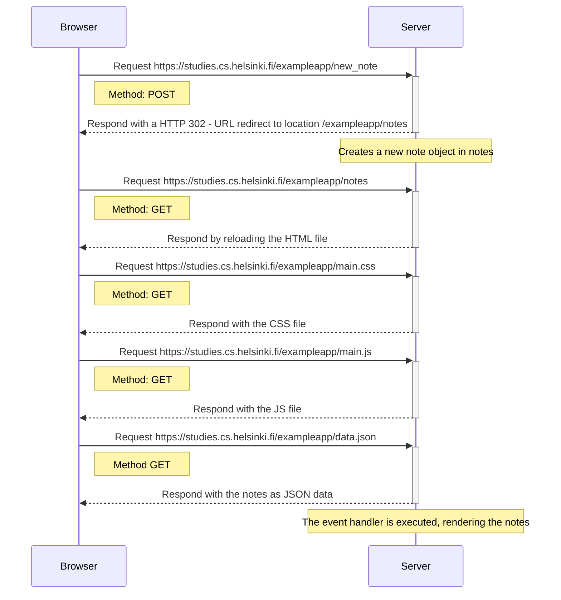

```mermaid
  sequenceDiagram
    participant B as Browser
    participant S as Server
    B->>+S: Request https://studies.cs.helsinki.fi/exampleapp/new_note
    Note right of B: Method: POST
    S-->>-B: Respond with a HTTP 302 - URL redirect to location /exampleapp/notes
    Note over S: Creates a new note object in notes 
    
    B->>+S: Request https://studies.cs.helsinki.fi/exampleapp/notes
    Note right of B: Method: GET
    S-->>-B: Respond by reloading the HTML file
    
    B->>+S: Request https://studies.cs.helsinki.fi/exampleapp/main.css
    Note right of B: Method: GET
    S-->>-B: Respond with the CSS file
    
    B->>+S: Request https://studies.cs.helsinki.fi/exampleapp/main.js
    Note right of B: Method: GET
    S-->>-B: Respond with the JS file
    
    B->>+S: Request https://studies.cs.helsinki.fi/exampleapp/data.json
    Note right of B: Method GET
    S-->>-B: Respond with the notes as JSON data
    Note over S: The event handler is executed, rendering the notes
```
  
