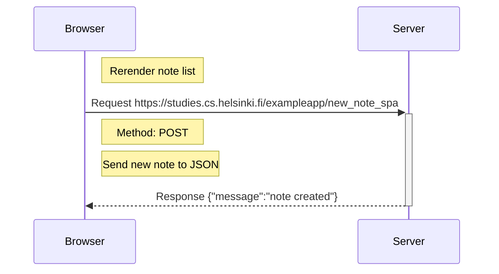

```mermaid
  sequenceDiagram
    participant B as Browser
    participant S as Server
    
    Note right of B: Rerender note list
    B->>+S: Request https://studies.cs.helsinki.fi/exampleapp/new_note_spa
    Note right of B: Method: POST
    Note right of B: Send new note to JSON
    S-->>-B: Response {"message":"note created"}
    
    
```
